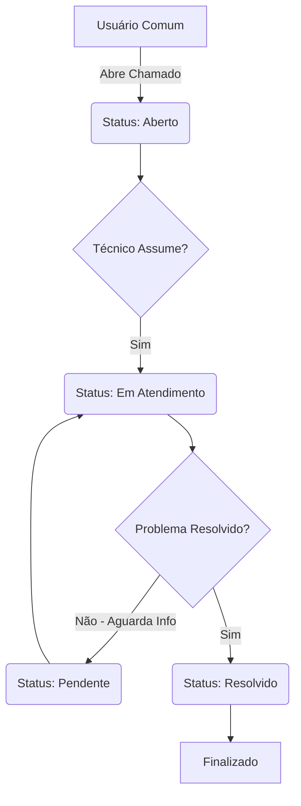

# 📚 Documentação Técnica - HelpingHub

Este documento detalha os fundamentos de engenharia do HelpingHub, garantindo que o sistema seja robusto, escalável e fácil de manter.

## 1. Engenharia de Requisitos e Organização do Projeto

### 1.1 Diagrama de Fluxo do Chamado (Ticket Lifecycle)
Abaixo, o fluxo que um ticket percorre desde a abertura até o fechamento:

Este documento detalha a organização, requisitos, gestão da qualidade e plano de manutenção do sistema HelpingHub.

### 1.2. Requisitos Funcionais (RF)
| ID | Requisito | Descrição | Prioridade
| :--- | :--- | :--- | :--- |
| RF01 | Cadastro/Login | O sistema deve autenticar usuários (Comum e Técnico). | Essencial |
| RF02 | Abertura de Ticket | O usuário comum deve descrever o problema e escolher uma categoria. | Importante |
| RF03 | Atribuição de Técnico | O sistema deve permitir que um técnico assuma um chamado aberto. | Importante |
| RF04 | Atualização de Status | O técnico deve poder alterar o status (Aberto, Em Atendimento, Pendente, Resolvido). | Essencial |
| RF05 | Histórico | O usuário deve visualizar seus chamados anteriores e resoluções. | Desejável |

### 1.3. Requisitos Não-Funcionais (RNF)
* **RNF01 (Segurança):** Criptografia de senhas via BCrypt.
* **RNF02 (Usabilidade):** Interface responsiva para dispositivos móveis.
* **RNF03 (Desempenho):** Tempo de resposta de requisições < 500ms.
* **RNF04 (Escalabilidade):** Banco de dados MySQL otimizado para crescimento de dados.

## 2. Gestão da Qualidade (ISO/IEC 25010)
A qualidade do HelpingHub é guiada pela norma **ISO/IEC 25010**, focando em Adequação Funcional e Usabilidade.

* **Padrões de Código:** Uso de ESLint e Prettier para padronização do TypeScript.
* **Code Review:** Todo Pull Request deve ser revisado por pelo menos um colega.
* **Integração Contínua (CI):** Execução automática de testes a cada commit.

Adotamos métricas baseadas na norma internacional de qualidade de software:

* **Adequação Funcional:** Garantir que o sistema cubra 100% das necessidades de um Help Desk básico.
* **Usabilidade:** Aplicação de heurísticas de Nielsen para garantir que o usuário comum não precise de treinamento.
* **Confiabilidade:** O sistema deve manter a integridade dos dados mesmo em falhas de conexão durante o salvamento.

## 3. Planejamento da Manutenção
Para garantir a vida útil do software, adotamos:
* **Manutenção Corretiva:** Resposta a bugs em até 24h para severidade alta.
* **Manutenção Adaptativa:** Atualização semestral de bibliotecas (Node/React).
* **Manutenção Perfectiva:** Inclusão de novas funcionalidades baseadas no feedback do PO.
* **Manutenção Preventiva:** Refatoração de código complexo identificada pelo SonarQube.