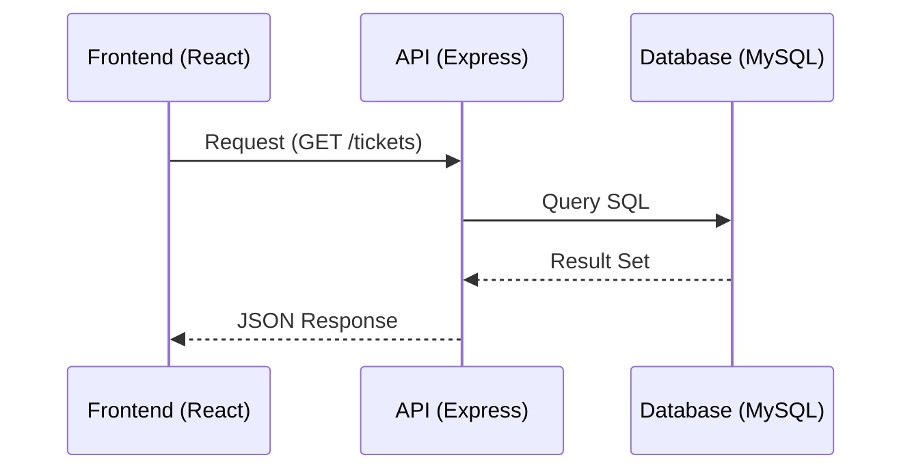

# 🛠️ Arquitetura e Protótipo

## 1. Visão Arquitetural
O HelpingHub utiliza uma arquitetura **Client-Server** desacoplada:



## 2. Design de Interface (UI/UX)

O protótipo foi desenvolvido focando na acessibilidade e eficiência:

* **Componentização:** Uso de Atomic Design (Atalhos, Moléculas, Organismos).
* **Responsividade:** Grid system baseado em Flexbox para funcionamento em desktops e tablets.
* **Feedback Visual:** Toasts de notificação para cada mudança de status do ticket.

O design foi estruturado focando na experiência do usuário e na agilidade do atendimento. Possui usuários de teste na primeira tela. Você pode acessar o protótipo interativo e as especificações de design no link abaixo:

👉 [**Protótipo Interativo no Figma**](https://www.figma.com/make/rKdbQ6wITtCuyFwQEjesyA/Design-Proposal-for-HelpingHub?fullscreen=1)

## 3. Modelagem de Dados (ER)

```typescript
/**
 * Interface principal de domínio
 */
export interface ITicket {
  id: string;
  requesterId: string; // Relacionado ao Usuário
  technicianId?: string; // Opcional até ser assumido
  subject: string;
  description: string;
  priority: 'low' | 'medium' | 'high' | 'urgent';
  category: 'hardware' | 'network' | 'software' | 'access';
  status: 'open' | 'in_progress' | 'pending' | 'resolved';
  updatedAt: Date;
}
```